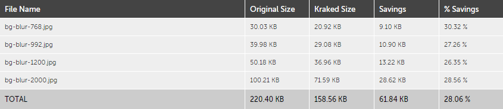

# Angewandte Themen

## HTML

## CSS

- Autoprefixer für Browser-spezifische CSS-Properties (z.B. "user-select: none;" in game.less)

## DOM

- Event Bubbling
  Ein Event-Listener auf dem Spielfeld um Click-Events aller Felder zu verarbeiten

## JavaScript

- JavaScript am Ende der HTML-Seite eingebunden, damit der Browser bereits mit dem Rendering der Seite beginnen kann.

## NodeJS

## REST

## Express

- Front Controller Pattern mit Routes, Controllers und Services

## Engineering Grundlagen

## UX

6+1 von 125 Designprinzipien:

- Affordanz  
  Masken und Beschriftungen so designed, damit keine Erklärungen und Hilfetexte nötig sind  
  Leichte Bedienung durch Gast-Modus um sofort mit dem Spiel beginnen zu können
- Anordnung (Optische Ausrichtung)  
  Zusammengehörende Elemente für Chat, Spiel, Lobby, etc. wurden aneinander ausgerichtet, um das Auge des Betrachters zu führen.
- Blank Slate  
  Grafik und Info, wenn noch keine Räume oder Chat-Nachrichten vorhanden sind
- Farbe  
  (Farbkreis und Farbharmonie)
- Fitt's Law  
  Grösse von Schaltflächen für Touch-Bedienung optimiert
  Mauswege durch geschickte Anordnung der einzelnen Komponenten optimiert
- Horror Vacui  
  Bewusst leere Bereiche auf den Screens freigehalten um Ansichten nicht zu überladen und die Wahrnehmung des Benutzers auf das Wesentliche zu lenken
- Progressive Disclosure  
  (nicht jedem User die gesamte Funktionalität zeigen)

## Angular

## Responsive Design

## Automatisierung

## Testing

## Modularisierung

## Site Optimization

- Image-Fonts für Icons
- Korrekte Bild-Formate (JPEG für Background-Foto)
- Miminized Images mittels Kraken.io (Resultat siehe unten)
- Responsive Images (Background-Image)
- JavaScript am Schluss der Seite
- Effizientes CSS ohne tiefe Verschachtelungen
- Concat und Minify CSS (gulp build --stage prod)
- Concat, Minify und Uglify JS (gulp build --stage prod)

Resultat Bildoptimierung mit Kraken.io:

## Web Security

Passwörter verschlüsselt gespeichert:

- Passwort-Hash mit PBKDF2 (crypto.pbkdf2)
- Salt mit Zufallszahl (crypto.randomBytes)

NodeJS:

- Cookie-basiertes Session-Handling
- httpOnly-Flag gesetzt
- Header "x-powered-by" deaktiviert
- Request-Validierung über Parameter und User-Authorization

Cross Site Scripting:

- Alphanumeric Whitelist für Benutzernamen (Client- und Server-seitig mittels RegExp geprüft)
- Whitelist für Raum-Namen in Lobby
- Filter für nicht erlaubte Zeichen im Chat
- Alle Eingabefelder mittels Eingabe von "" geprüft

## Accessibility

Formular-Markup und -Validierung

- Labels für Formularfelder
- Gültige und ungültige Felder farblich und mit Symbol hervorgehoben

Tastaturbedienbarkeit

- Tastaturbedienung getestet
- Spiel um Tastaturbedienung mittels Pfeiltasten links, rechts, unten plus Enter und Space erweitert

Skalierbarkeit

- Anwendung ist frei skalierbar
