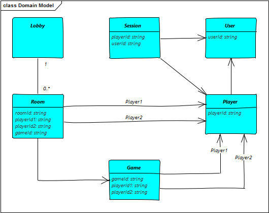
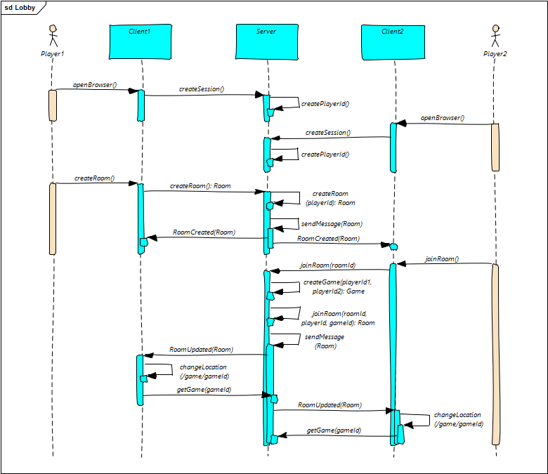
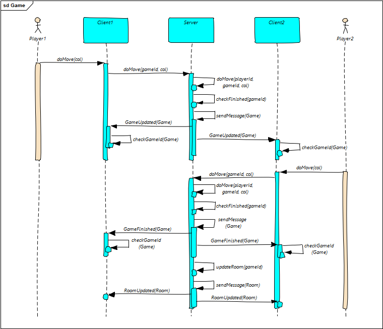
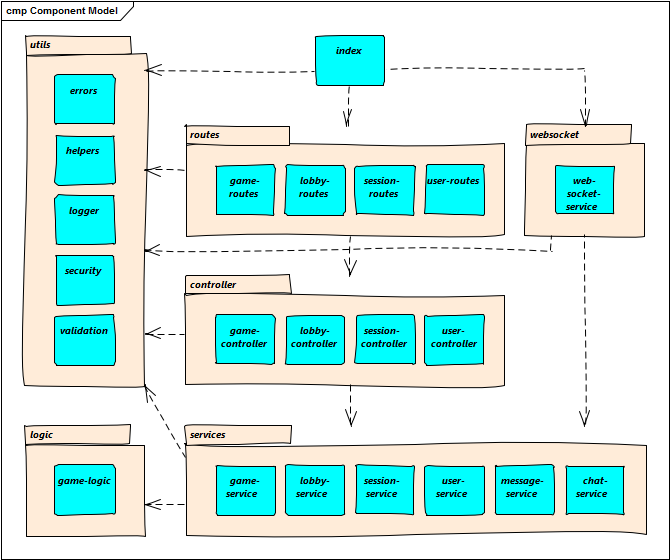

# Design

## Domänenmodell

Das nachfolgende Klassendiagramm zeigt das Domänenmodell, welches auf dem Server implementiert ist und mit dem Client zur Kommunikation verwendet wird:

**Lobby**
Die Lobby hält eine Liste von Rooms.

**Room**
Ein Room wird vom einem Player erstellt und kann vom einem weiteren Player betreten werden.

**Game**
Ein Room mit zwei Playern startet ein Game für diese zwei Player.

**Player**
Ein Player identifiziert einen Client bzw. eine Session und besteht in jedem Fall, unabhängig davon, ob sich der User authentisiert hat oder nicht. Der Player bleibt weiter konstant, wenn sich ein Gast-User am Spiel anmeldet.

**Session**
Der automatisch erstellte Player wird in der Session des jeweiligen Clients geführt.

**User**
Wenn sich ein Player anmeldet, so wird der User erstellt bzw. geladen und mit der Session verknüpft.

## Spielstart

Das nachfolgende Sequenzdiagramm zeigt die Interaktion zwischen zwei Clients um ein Spiel zu starten:

**Create Session**
Beim Öffnen des Browsers wird automatisch die Session inklusive PlayerId erstellt, die jeden Player/Client eindeutig identifiziert.

**Create Room**
Der Client 1 erstellt einen Room, welcher an alle aktiven Clients verteilt wird.

**Join Room**
Der Client 2 tritt einem bestehen Room bei, worauf ein neues Games gestartet und mit dem Room verknüpft wird. Der mit der GameId aktualisierte Room wird an die beteiligten Clients verteilt, worauf beide Clients mittels GameId das erstellte Spiel laden und darstellen.

## Spiel

Das nachfolgende Sequenzdiagramm zeigt die Interaktion zwischen zwei Clients um ein Spiel zu Ende zu spielen:

**Erster Spielzug**
Der Client 1 wählt eine Spalte in einem laufenden Spiel. Der Server führt den Zug aus, prüft das Spiel auf einen Gewinner und sendet das aktualisierte Spiel an beide Clients.

**Letzter Spielzug**
Der Client 2 wählt eine Spalte in einem laufenden Spiel. Der Server führt den Zug aus, prüft das Spiel auf einen Gewinner und sendet das aktualisierte Spiel an beide Clients. Durch das beendete Spiel aktualisiert sich der Room zum Spiel und der Server sendet den aktualisierten Room an beide Clients

## Server-Komponenten

Das nachfolgende Komponentendiagramm zeigt die Komponenten des Servers und deren Abhängigkeiten:

**index**
Gestartet und initialisiert wird der Server über index.

**routes**
Die Routes definierten die URLs und Controller-Methoden der einzelnen Module.

**controller**
Die Controller ermitteln die PlayerId, lesen und validieren die Request-Parameter, rufen die entsprechende Methode auf dem Service auf und liefern das Resultat bzw. eine entsprechende Fehlermeldung an den Client zurück.

**services**
Die Services laden die Daten, führen die Geschäftslogik aus, speichern die modifizierten Daten und verteilen ggf. Update-Messages über den Message-Service. Der Message-Service verwendet einen NodeJS.EventEmitter, um die Events an die registrierten Listener zu verteilen.

**logic**
Die Game-Logic kapselt Zustand und Verhalten eines Games, welches vom Game-Service geladen und gespeichert wird.

**utils**
Die Utils enthalten die Layer-übergreifenden Module.

**websocket**
Der WebSocket-Service nimmt Messages von den Clients entgegen, verteilt diese über den Message-Service an die registrierten Listener und schickt an Client addressierte Messages vom Message-Service an die Clients.
